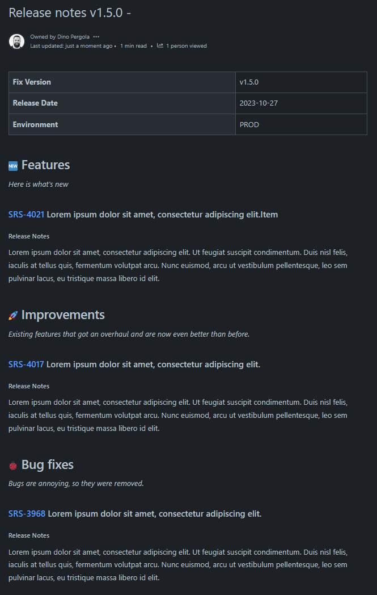

# Multi project release note generator for Jira and Confluence

This is a simple tool that helps you generate release notes in confluence based
on Jira releases over multiple projects.

It uses the Jira and Confluence REST APIs to retrieve issue data from Jira and create
pages in Confluence.

## Installation

This tool is based on nodejs. Make sure you have the latest stable version of nodejs installed on your machine.

**Install dependencies**

```bash
npm run install
```

**Define environment variables**  
Copy _.env.template_ and rename to _.env_ then replace all values with your atlassian information.

```bash
JIRA_API_TOKEN="CHANGE_ME"
JIRA_BASE_URL="CHANGE_ME"
JIRA_EMAIL="CHANGE_ME"
```

## Usage

### Configuring the release notes

Before running the tool open the _config.json_ to configure the release notes.  
The tool will validate the configuration before creating the release notes.  
Check console output in case of errors.

```json
{
    "fixVersion": "String", // Fix version / release. Must exist in Jira releases
    "releaseMetaInformation": [
        // Some basic meta data for the release which should always be provided
        { "name": "Release Date", "value": "String" }, // Format must be YYYY-MM-DD
        { "name": "Environment", "value": "String" } // E.g., PROD, INT, DEV, ...
    ],
    "projects": ["String"], // List of projects to include issues from
    "space": "String", // Name of the space where the release notes should be created
    "parentPage": "String", // The name of the parent page in Confluence. The release notes will be placed below this page.
    "fallBackTitleEmoji": "String", // Can also be an unicode emoji e.g., 🆕
    "releaseNotesField": "String", // Name of the Jira issue field that contains the release notes. Can be a custom field.
    "missingReleaseNotesText": "No release notes available.", // Text to put on the page if no release notes are in Jira.
    "content": {
        "additionalPageProperties": [{ "name": "String", "value": "String" }], // Optional additional page properties
        "sections": [
            // Define sections in the release notes and which issue types should be listed in it.
            // At least one section must be defined.
            {
                "emoji": "String", // Name of the emoji as it is called in confluence e.g., rocket, new, ...
                "title": "String", // Section title
                "subTitle": "String", // Section subtitle. Italic below section title.
                "includeIssueTypes": ["String"] // Jira issue types to include in the section
            }
        ]
    }
}
```

### Generate the release notes

Using Windows cmd:

```bash
genReleaseNotes.cmd
```

Using NPM:

```bash
npm run release
```

### Example release notes


